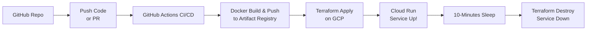
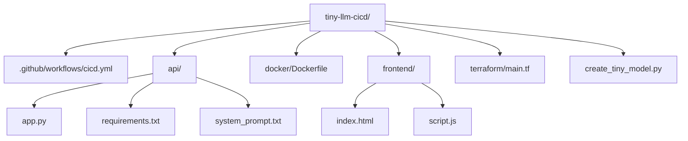

Below is a **detailed, user-friendly README** you can attach to your portfolio. It uses **Mermaid diagrams** to illustrate the CI/CD flow and overall architecture, clarifies each step, and showcases how your ephemeral, tiny LLM demo works end-to-end.

---

# Tiny LLM CICD Demo

> **A fully automated, ephemeral LLM chatbot project** that spins up on **Google Cloud Run**, uses a **tiny GPT-2–style** model stored in **Git**, serves a **chat interface** at the root URL, and **tears itself down** after each demo. Perfect for showcasing modern **MLOps**/**AIOps** best practices.

## Table of Contents

1. [Overview](#overview)  
2. [Architecture & Flow](#architecture--flow)  
3. [Features](#features)  
4. [Prerequisites](#prerequisites)  
5. [Step-by-Step Setup](#step-by-step-setup)  
6. [Repository Structure](#repository-structure)  
7. [How It Works](#how-it-works)  
8. [Local Testing](#local-testing)  
9. [Customization & Next Steps](#customization--next-steps)  
10. [Credits & License](#credits--license)  

---

## Overview

Welcome to **Tiny LLM CICD Demo**, a project that demonstrates:

- **Tiny GPT-2–Style Model**: A minuscule GPT architecture with **real GPT-2 vocab** for demonstration (random weights).  
- **Chat Interface**: A friendly web UI to type messages and see (nonsensical) chatbot replies.  
- **End-to-End CI/CD**: A GitHub Actions pipeline builds Docker images, deploys to Cloud Run with Terraform, and tears everything down automatically.  
- **Ephemeral & Cost-Efficient**: The Cloud Run service is destroyed after 10 minutes, ensuring minimal costs.  

Even though the model outputs random text, it highlights **best MLOps** practices: storing everything in code, ephemeral infra, versioning the system prompt, etc.

---

## Architecture & Flow

Below is a **Mermaid diagram** outlining the high-level CI/CD pipeline:



### What Happens?

1. You **commit** or **merge** into `main`.  
2. **GitHub Actions** checks out code, authenticates with GCP, and **builds** a Docker image.  
3. The image is **pushed** to **Artifact Registry** in GCP.  
4. **Terraform** then **deploys** that image to **Cloud Run** (creating a brand-new service).  
5. The pipeline **sleeps for 10 minutes** (so you can test the service).  
6. Finally, **Terraform destroys** the service, freeing all resources.

---

## Features

1. **Tiny GPT-2 Model**  
   - Created via `create_tiny_model.py`.  
   - Real GPT-2 tokenizer with minimal embedding/architecture = random output but realistic tokens.

2. **Automatic DevOps Flow**  
   - On commit, everything is built and deployed within minutes, **then** auto-destroyed after 10 minutes.

3. **Chat Interface**  
   - A minimal HTML/JS page to **send** user prompts.  
   - Displays user + bot messages in a chat-like format.

4. **Ephemeral GCP**  
   - Uses **Cloud Run** for a container-based deployment.  
   - **Cost-saving** since the environment lives only briefly.

5. **Version Control**  
   - The **system prompt** and the **model** are versioned in Git, showcasing how you can treat ML “logic” as code.

---

## Prerequisites

1. **Google Cloud Project**  
   - Enable **Cloud Run**, **Artifact Registry**, and **IAM** APIs.  
   - Create an **Artifact Registry** (Docker repository).  
   - Create a **Service Account** with roles:
     - **Artifact Registry Admin**  
     - **Cloud Run Admin**  
     - **Service Account User**  
   - Download a JSON key for that service account (we’ll use it in GitHub secrets).

2. **GitHub Repository**  
   - Add the following **secrets** in **Settings → Secrets → Actions**:
     - `GCP_SA_KEY` = contents of your service account JSON  
   - You can skip `GCP_PROJECT_ID` and `GCP_REGION` because our Terraform is **hardcoded** for the sake of the example. Adjust as needed if you prefer dynamic variables.

3. **Local Dev Tools**  
   - (Optional) If you want to run locally, ensure you have **Python 3.9+** and `pip`.

---

## Step-by-Step Setup

1. **Clone This Repo**  
   ```bash
   git clone https://github.com/YourUsername/tiny-llm-cicd.git
   cd tiny-llm-cicd
   ```

2. **Install Dependencies (Optional Local Test)**  
   ```bash
   cd api
   pip install -r requirements.txt
   ```

3. **(Re)Generate the Tiny Model** (Optional)  
   ```bash
   python create_tiny_model.py
   ```
   - This script downloads the real GPT-2 tokenizer and creates a 1-layer GPT-2 model with random weights.  
   - You’ll see files like `vocab.json`, `merges.txt`, and `pytorch_model.bin` in `model/`.

4. **Commit & Push**  
   - Make sure your `.gitignore` doesn’t exclude the new model files if you want them tracked in Git.  
   - Once you push to `main`, the GitHub Actions pipeline will run.

5. **Check GitHub Actions**  
   - In your repo, go to **Actions** and watch the pipeline.  
   - The pipeline will:  
     1. **Build** the Docker image,  
     2. **Push** to Artifact Registry,  
     3. **Terraform apply** to deploy Cloud Run,  
     4. **Sleep** for 10 minutes,  
     5. **Terraform destroy**.

6. **Visit the Cloud Run URL**  
   - Look at the **Terraform output** in the pipeline logs for `cloud_run_url`.  
   - Go to that URL in your browser **within 10 minutes**.  
   - You’ll see your **tiny chatbot** UI. Type a message, watch the random response.  

---

## Repository Structure

```bash
tiny-llm-cicd/
├── .github/
│   └── workflows/
│       └── cicd.yml          # GitHub Actions pipeline
├── api/
│   ├── app.py                # Flask app + LLM logic
│   ├── requirements.txt
│   └── system_prompt.txt     # "System" or role prompt
├── docker/
│   └── Dockerfile            # Docker build instructions
├── frontend/
│   ├── index.html            # Chat UI
│   └── script.js             # Chat logic (calls /generate)
├── terraform/
│   └── main.tf               # GCP infra definitions (Cloud Run, IAM)
├── create_tiny_model.py      # Script to create random GPT-2 style model
└── README.md                 # Project documentation
```

### Mermaid Directory Diagram



---

## How It Works

1. **`create_tiny_model.py`**  
   - Downloads GPT-2 tokenizer from Hugging Face.  
   - Creates a single-layer GPT-2 model with random weights.  
   - Saves to `model/`.

2. **`app.py`**  
   - **Flask** server that loads the model + tokenizer from `model/`.  
   - Serves a **chat** UI at the root `/`.  
   - Exposes `/generate` for text generation.  

3. **`index.html` + `script.js`**  
   - Renders a simple chat layout.  
   - Calls **POST** `/generate` for each user message.

4. **`Dockerfile`**  
   - Copies everything into an image.  
   - Runs `app.py` on port **8000**.

5. **`cicd.yml`**  
   - **Builds** Docker → **Pushes** to Artifact Registry → **Terraform** apply/destroy.  
   - Sleeps 10 minutes for ephemeral demo.

6. **`main.tf`**  
   - Defines a **Google** provider for **region** + **project**.  
   - Creates a Cloud Run service from our **Docker image**.  
   - Grants unauthenticated access.

---

## Local Testing

If you’d like to run the chatbot **locally**:

1. **Install** Python dependencies in a virtual environment:
   ```bash
   cd api
   pip install -r requirements.txt
   ```
2. **Create** or confirm you have the tiny model in `model/`.  
3. **Run**:
   ```bash
   python app.py
   ```
4. **Open** [http://127.0.0.1:8000](http://127.0.0.1:8000).  
5. Type a message; get your random response.

You’ll see weird, repeated tokens (like “SpaceX SpaceX…”) due to untrained weights, but it confirms the pipeline is working.

---

## Customization & Next Steps

1. **Use a Real Checkpoint**  
   - Swap out `pytorch_model.bin` with a real DistilGPT2 or GPT2 model from Hugging Face for coherent responses.  
   - Beware of larger file sizes (hundreds of MB).

2. **Add Logging/Monitoring**  
   - Tie in Stackdriver logs or a real monitoring pipeline to see usage metrics.

3. **Refine the Chat UI**  
   - Add advanced front-end frameworks or styling.  
   - Display conversation history more elegantly.

4. **Production Hardening**  
   - Use environment variables instead of hardcoding GCP region.  
   - Restrict service account permissions.  
   - Increase Terraform security modules.
