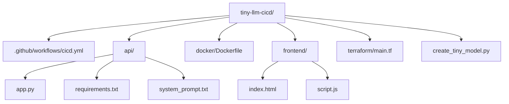

# Tiny LLM CICD Demo :rocket:

> A fully automated, **ephemeral** LLM chatbot project that dynamically **builds** a tiny GPT-2–style model at Docker **build time**, deploys it to **Google Cloud Run** with a **GitHub Actions** pipeline, and tears it all down automatically.

---

## Table of Contents

1. [Overview](#overview)  
2. [Architecture & Flow](#architecture--flow)  
3. [Features](#features)  
4. [Latest Enhancements](#latest-enhancements)  
5. [Prerequisites](#prerequisites)  
6. [Setup & Deployment](#setup--deployment)  
7. [Repository Structure](#repository-structure)  
8. [How It Works](#how-it-works)  
9. [Local Testing](#local-testing)  
10. [Enhancing `create_tiny_model.py`](#enhancing-createtiny_modelpy)

---

## Overview

This project showcases how to:

- **Generate** a tiny GPT-2–style model **on the fly** inside the Docker image (no local `model/` folder!).  
- Serve a **simple chat interface** with random nonsense text.  
- **Automate** the entire build-deploy-destroy cycle using **Terraform** and **GitHub Actions**.  
- Provide a quick & easy **MLOps** demonstration with ephemeral **Cloud Run** resources.  

Even though the model is **random**, the pipeline is entirely **real**—perfect for demonstrating **DevOps** and **MLOps** skills in a modern infrastructure.

---

## Flow

1. You **push** code or open a PR.  
2. **GitHub Actions** runs:
   - **Builds** a Docker image which **dynamically** creates a tiny GPT-2–style model.
   - **Scans** the image for vulnerabilities (CRITICAL only, ignoring certain known CVEs).
3. If the scan **passes**, the image is **pushed** to **Artifact Registry**.  
4. **Terraform** deploys that image to **Cloud Run** in an ephemeral environment.  
5. After a short wait (for demo/testing), the pipeline **destroys** everything.

---

## Features

1. **Model Generated at Build Time**  
   - No local `model/` or `pytorch_model.bin`. A script dynamically creates the tiny GPT-2–style model inside the Docker container.

2. **End-to-End CI/CD**  
   - On every push, the pipeline handles build, scanning, push, deployment, and tear-down—**fully automated**.

3. **Chat Interface**  
   - Minimal HTML/JS for user → bot messages.  
   - Although outputs are random, the flow mimics a real chatbot experience.

4. **Ephemeral Cloud Run**  
   - **Cost** remains low. The service is ephemeral (short-lived) and self-destructs.

5. **Separate Docker Push Stage**  
   - The pipeline **only** pushes the Docker image if it **passes** vulnerability scanning, ensuring code quality and security gates are enforced by default.

---

## Latest Enhancements

1. **Docker Scanning with Trivy**  
   - Scans for **CRITICAL** vulnerabilities, ignoring a specific known CVE (`CVE-2023-6730`) for demonstration purposes.  
   - Offers a real example of DevSecOps best practices in a minimal environment.

2. **Multi-Stage CI**  
   - The pipeline now has distinct jobs for building the Docker image, scanning it, and pushing it—showing how a more complex, enterprise-grade CI structure might look.

3. **Ephemeral Infrastructure**  
   - Terraform is used to apply and then destroy the entire Cloud Run service automatically, demonstrating cost-effective, short-lived test environments (also known as “ephemeral environments”).

4. **MLOps Integration**  
   - The pipeline trains (or reuses) a tiny GPT-2 model, packaging the final weights into the Docker container, bridging the gap between machine learning steps and DevOps.

---

## Prerequisites

1. **Google Cloud Project**  
   - Enable **Cloud Run**, **Artifact Registry**, and **IAM**.  
   - Create a **Docker** repository in **Artifact Registry**.  
   - Create a **service account** with:
     - `Artifact Registry Admin`  
     - `Cloud Run Admin`  
     - `Service Account User`

2. **GitHub Secrets**  
   - Add a secret named `GCP_SA_KEY` containing the JSON credentials for that service account.  
   - The pipeline references it for authentication.

3. **Local Tools**  
   - If you want to test everything locally: Python 3.9+, `pip install -r api/requirements.txt`.

---

## Setup & Deployment

1. **Clone** this repo:

   ```bash
   git clone https://github.com/MLegkovskis/tiny-llm-cicd.git
   cd tiny-llm-cicd
   ```

2. **Configure** `.github/workflows/cicd.yml` and `terraform/main.tf`  
   - Ensure your **project ID** and **region** match your GCP environment.

3. **Commit & Push**  
   - GitHub Actions will:
     1. **Build** and **scan** the Docker image.  
     2. **Push** it to your Artifact Registry (if scanning passes).  
     3. **Deploy** to Cloud Run via Terraform.  
     4. **Wait** a few minutes, then automatically **destroy** the resources.

4. **Test**  
   - In the GitHub Actions logs, look for the `cloud_run_url` output.  
   - Open that link—test the chatbot in your browser.  
   - After a few minutes, the pipeline destroys the resources, incurring no ongoing cost.

---

## Repository Structure

```
tiny-llm-cicd/
├── .github/
│   └── workflows/
│       └── cicd.yml         # 🛠️ GitHub Actions pipeline
├── api/
│   ├── app.py               # Flask app + chat endpoints
│   ├── requirements.txt
│   └── system_prompt.txt    # The system prompt text
├── docker/
│   └── Dockerfile           # Builds Docker, calls create_tiny_model.py
├── frontend/
│   ├── index.html           # Chat interface
│   └── script.js            # Basic JS to POST /generate
├── terraform/
│   └── main.tf              # Cloud Run + IAM ephemeral infra
├── create_tiny_model.py     # Dynamically creates model at Docker build
└── README.md                # This file
```

**Mermaid Diagram**:



---

## How It Works

1. **`create_tiny_model.py`**  
   - Runs *inside* Docker build (or locally if you prefer).  
   - Downloads GPT-2 tokenizer from Hugging Face, sets up a “single-layer GPT-2” config, then saves weights into `/app/model`.

2. **`Dockerfile`**  
   - Uses a **PyTorch base image** for quick torch availability.  
   - Installs Python deps, runs `create_tiny_model.py` inside the container.  
   - Copies in the web app (Flask + front end).

3. **`app.py`**  
   - Loads the model from `/app/model`.  
   - Serves a chat UI at `/`.  
   - On `POST /generate`, it runs a quick text generation with the newly trained random GPT-2.  

4. **Terraform**  
   - Deploys the Docker image to Cloud Run, creates a service account, and grants `roles/run.invoker` to `allUsers` so it’s publicly accessible.

5. **GitHub Actions**  
   - **Build** → **Scan** → **Push** → **Terraform Apply** → **Wait** → **Terraform Destroy**.  
   - Everything is ephemeral and automated.

---

## Local Testing

1. **Install Requirements**:

   ```bash
   cd api
   pip install -r requirements.txt
   cd ..
   ```

2. **Train** the tiny GPT-2 model locally if desired:

   ```bash
   python create_tiny_model.py --train --force-train
   ```

   This places the model in `./model`. Typically the pipeline handles this in Docker.

3. **Run** the Flask app:

   ```bash
   python api/app.py
   ```

4. **Open** [http://127.0.0.1:8000](http://127.0.0.1:8000) and enjoy random GPT-2 text generation.

---

## Enhancing `create_tiny_model.py`

Currently, `create_tiny_model.py`:

- Creates a **random** single-layer GPT-2 config.  
- Downloads GPT-2’s **tokenizer** from Hugging Face.  

**For a more realistic model**:

1. Remove the random `GPT2Config(...)` calls.  
2. Use `GPT2LMHeadModel.from_pretrained("distilgpt2")` (or `"gpt2"`).  
3. Then `save_pretrained("model")` if you want the real model packaged in your Docker image.

However, be mindful that a full GPT-2 or DistilGPT2 will significantly **increase** the container size. In production, you might store large models in a dedicated registry or fetch them at runtime, balancing cost and performance.
