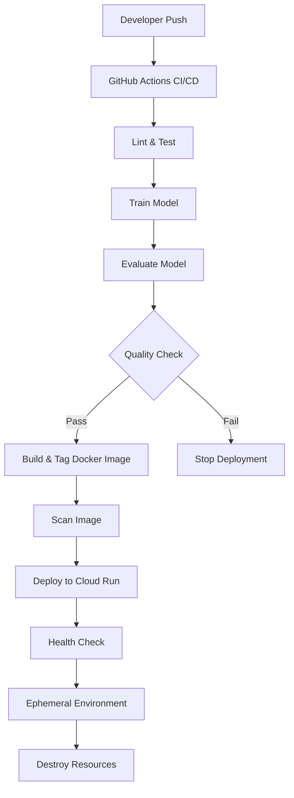

# Tiny LLM CICD: MLOps Pipeline Showcase 

> A production-grade MLOps pipeline that fine-tunes a DistilGPT2 model, evaluates its quality, and deploys it to Google Cloud Run with comprehensive CI/CD, infrastructure as code, and automated testing.

---

## Table of Contents

1. [Overview](#overview)  
2. [Architecture & Flow](#architecture--flow)  
3. [Key Features](#key-features)  
4. [Technical Components](#technical-components)  
5. [MLOps Best Practices](#mlops-best-practices)  
6. [Prerequisites](#prerequisites)  
7. [Setup & Deployment](#setup--deployment)  
8. [Repository Structure](#repository-structure)  
9. [How It Works](#how-it-works)  
10. [Local Testing](#local-testing)  
11. [Development Roadmap](#development-roadmap)

---

## Overview

This project demonstrates a comprehensive MLOps pipeline for fine-tuning, evaluating, and deploying a language model. It showcases:

- **Production-grade model training** with DistilGPT2 and proper fine-tuning techniques
- **Robust model evaluation** with perplexity metrics and quality thresholds
- **Versioned deployments** using Git SHA-based Docker image tagging
- **Comprehensive testing** with unit tests for all components
- **Infrastructure as code** with parameterized Terraform configurations
- **Professional UI** with modern design and user experience
- **End-to-end CI/CD pipeline** with GitHub Actions

The entire system is designed to demonstrate MLOps best practices in a real-world scenario, perfect for showcasing AI engineering skills.

---

## Architecture & Flow



1. **Development**: Code changes are pushed to GitHub
2. **Quality Gates**: 
   - Linting and automated tests run
   - Model is trained (or retrieved from cache)
   - Model quality is evaluated against thresholds
3. **Deployment**:
   - Docker image is built with Git SHA tag
   - Image is scanned for vulnerabilities
   - Terraform deploys to Cloud Run with health checks
4. **Cleanup**: Resources are automatically destroyed after demo period

---

## Key Features

### 1. Production-Grade Model Training
- Uses pre-trained **DistilGPT2** from Hugging Face
- Implements proper fine-tuning with learning rate scheduling
- Includes dataset handling with tokenization and batching
- Supports training from scratch or incremental fine-tuning

### 2. Model Evaluation Framework
- Calculates **perplexity** on validation dataset
- Generates sample responses for qualitative assessment
- Enforces quality thresholds for deployment
- Produces detailed evaluation reports

### 3. Versioned Deployments
- Uses Git SHA for Docker image tagging
- Ensures reproducibility and traceability
- Supports rollback to previous versions
- Maintains latest tag for convenience

### 4. Comprehensive Testing
- Unit tests for model training, evaluation, and API
- Linting with flake8 for code quality
- Test coverage for critical components
- Automated test execution in CI pipeline

### 5. Infrastructure as Code
- Parameterized Terraform configuration
- Cloud Run service with health checks
- Resource scaling and concurrency settings
- Security and access control

### 6. Professional UI
- Modern, responsive design
- Real-time typing indicators
- Error handling and user feedback
- Energy/sustainability theme

### 7. CI/CD Pipeline
- GitHub Actions workflow
- Multi-stage build process
- Quality gates and security scanning
- Automated deployment and cleanup

---

## Technical Components

| Component | Technology | Description |
|-----------|------------|-------------|
| **ML Framework** | Transformers (Hugging Face) | State-of-the-art NLP models and tools |
| **Base Model** | DistilGPT2 | Efficient pre-trained language model |
| **Training** | PyTorch | Deep learning framework for model training |
| **API** | Flask | Lightweight web framework for serving model |
| **Frontend** | HTML/CSS/JS | Modern responsive UI for chatbot interface |
| **Container** | Docker | Application packaging and deployment |
| **CI/CD** | GitHub Actions | Automated workflow orchestration |
| **Infrastructure** | Terraform | Infrastructure as code for Cloud Run |
| **Cloud Provider** | Google Cloud Platform | Scalable cloud infrastructure |
| **Deployment** | Cloud Run | Serverless container deployment |
| **Registry** | Artifact Registry | Container image storage |
| **Security** | Trivy | Container vulnerability scanning |

---

## MLOps Best Practices

This project demonstrates several MLOps best practices:

### 1. Model Development
- **Reproducibility**: Fixed random seeds and versioned dependencies
- **Modularity**: Separation of training, evaluation, and serving
- **Configurability**: Parameterized training and evaluation

### 2. Testing & Quality
- **Automated Testing**: Unit tests for all components
- **Evaluation Metrics**: Perplexity calculation and thresholds
- **Code Quality**: Linting and style enforcement

### 3. Deployment & Operations
- **Containerization**: Docker packaging of model and application
- **Infrastructure as Code**: Terraform for reproducible environments
- **Health Monitoring**: Liveness and readiness probes

### 4. CI/CD Pipeline
- **Automation**: End-to-end automated workflow
- **Quality Gates**: Tests and evaluations must pass before deployment
- **Security Scanning**: Vulnerability detection before deployment

### 5. Versioning & Reproducibility
- **Model Versioning**: Git SHA-based image tagging
- **Artifact Management**: Versioned Docker images in registry
- **Traceability**: Each deployment linked to specific code version

---

## Prerequisites

1. **Google Cloud Project**  
   - Enable **Cloud Run**, **Artifact Registry**, and **IAM**
   - Create a **Docker** repository in **Artifact Registry**
   - Create a **service account** with:
     - `Artifact Registry Admin`  
     - `Cloud Run Admin`  
     - `Service Account User`

2. **GitHub Secrets**  
   - Add a secret named `GCP_SA_KEY` containing the JSON credentials for that service account

3. **Local Development Environment**  
   - Python 3.9+
   - Docker
   - Terraform (optional, for local infrastructure testing)

---

## Setup & Deployment

1. **Clone** this repo:

   ```bash
   git clone https://github.com/MLegkovskis/tiny-llm-cicd.git
   cd tiny-llm-cicd
   ```

2. **Configure** environment variables:
   - Update project ID, region, and repository name in:
     - `.github/workflows/cicd.yml`
     - `terraform/variables.tf` (defaults)

3. **Install** dependencies for local development:

   ```bash
   pip install -r api/requirements.txt
   pip install pytest pytest-mock
   ```

4. **Commit & Push**  
   - GitHub Actions will automatically:
     1. Run linting and tests
     2. Train and evaluate the model
     3. Build, tag, and scan the Docker image
     4. Deploy to Cloud Run via Terraform
     5. Destroy resources after demo period

---

## Docker Build

To build the Docker image locally:

```bash
# Build with latest tag
docker build -t europe-west2-docker.pkg.dev/tiny-llm-cicd/tiny-llm-app/tiny-llm-app:latest .

# Or build with Git SHA tag
docker build -t europe-west2-docker.pkg.dev/tiny-llm-cicd/tiny-llm-app/tiny-llm-app:$(git rev-parse --short HEAD) .
```

To push to Google Artifact Registry:

```bash
# Authenticate to Google Cloud
gcloud auth configure-docker europe-west2-docker.pkg.dev

# Push the image
docker push europe-west2-docker.pkg.dev/tiny-llm-cicd/tiny-llm-app/tiny-llm-app:latest
```

---

## Repository Structure

```
tiny-llm-cicd/
├── .github/workflows/
│   └── cicd.yml                # GitHub Actions pipeline
├── api/
│   ├── app.py                  # Flask API with health check
│   ├── requirements.txt        # API dependencies
│   └── system_prompt.txt       # System prompt for the model
├── data/
│   ├── training_data.txt       # Training dataset
│   └── validation_data.txt     # Validation dataset
├── docker/
│   └── Dockerfile              # Multi-stage Docker build
├── frontend/
│   ├── index.html              # Enhanced chat UI
│   └── script.js               # Frontend logic
├── terraform/
│   ├── main.tf                 # Cloud Run configuration
│   └── variables.tf            # Terraform variables
├── tests/
│   ├── test_api.py             # API endpoint tests
│   ├── test_create_tiny_model.py # Model training tests
│   └── test_evaluate_model.py  # Evaluation tests
├── create_tiny_model.py        # DistilGPT2 fine-tuning
├── evaluate_model.py           # Model evaluation framework
└── README.md                   # This documentation
```

---

## How It Works

### 1. Model Training (`create_tiny_model.py`)
- Downloads pre-trained DistilGPT2 from Hugging Face
- Fine-tunes on domain-specific data (energy/climate topics)
- Implements learning rate scheduling and optimization
- Saves the model for deployment

### 2. Model Evaluation (`evaluate_model.py`)
- Calculates perplexity on validation dataset
- Generates sample responses for qualitative assessment
- Enforces quality thresholds for deployment
- Produces detailed evaluation reports

### 3. API Service (`api/app.py`)
- Loads the fine-tuned model
- Provides a `/generate` endpoint for text generation
- Includes a `/health` endpoint for monitoring
- Serves the frontend UI

### 4. Frontend (`frontend/`)
- Modern, responsive chat interface
- Real-time typing indicators
- Error handling and user feedback
- Themed for energy/sustainability

### 5. CI/CD Pipeline (`.github/workflows/cicd.yml`)
- Runs linting and tests
- Trains and evaluates the model
- Builds, tags, and scans Docker images
- Deploys to Cloud Run via Terraform

### 6. Infrastructure (`terraform/`)
- Parameterized Cloud Run configuration
- Health check integration
- Scaling and concurrency settings
- Security and access control

---

## Local Testing

1. **Train and evaluate** the model:

   ```bash
   python create_tiny_model.py --output_dir=./model
   python evaluate_model.py --model_dir=./model --validation_file=./data/validation_data.txt
   ```

2. **Run tests**:

   ```bash
   pytest tests/ -v
   ```

3. **Start** the Flask app:

   ```bash
   python api/app.py
   ```

4. **Open** [http://127.0.0.1:8000](http://127.0.0.1:8000) to use the chatbot

---

## Development Roadmap

Future enhancements planned for this project:

### 1. Advanced Model Capabilities
- **RAG (Retrieval-Augmented Generation)**: Integrate external knowledge sources
- **Multi-lingual Support**: Train on multiple languages
- **Parameter-Efficient Fine-Tuning**: Implement LoRA or other PEFT techniques

### 2. Enhanced Infrastructure
- **Multi-Region Deployment**: Deploy to multiple GCP regions
- **Blue/Green Deployments**: Zero-downtime deployments
- **Auto-scaling**: Based on traffic patterns

### 3. Monitoring & Observability
- **Prometheus Integration**: Metrics collection
- **Logging Pipeline**: Centralized logging
- **Alerting**: Proactive notification of issues

### 4. Security Enhancements
- **Input Validation**: Prevent prompt injection
- **Rate Limiting**: Protect against abuse
- **Authentication**: Add user authentication

### 5. UI/UX Improvements
- **Chat History**: Persistent conversations
- **Accessibility**: WCAG compliance
- **Mobile App**: Native mobile experience

---

## License

This project is licensed under the MIT License - see the LICENSE file for details.

---

## Acknowledgments

- Hugging Face for the Transformers library
- Google Cloud Platform for hosting services
- The open-source community for tools and libraries

---

*This project is designed as a showcase of MLOps and AI Engineering skills.*
