# Tiny LLM CICD Demo 🚀

> A fully automated, **ephemeral** LLM chatbot project that dynamically **builds** a tiny GPT-2–style model at Docker **build time**, deploys it to **Google Cloud Run** with a **GitHub Actions** pipeline, and tears it all down automatically.

### Table of Contents
1. [Overview](#overview)  
2. [Architecture & Flow](#architecture--flow)  
3. [Features](#features)  
4. [Prerequisites](#prerequisites)  
5. [Setup & Deployment](#setup--deployment)  
6. [Repository Structure](#repository-structure)  
7. [How It Works](#how-it-works)  
8. [Local Testing](#local-testing)  
9. [Enhancing `create_tiny_model.py`](#enhancing-createtiny_modelpy)

---

## Overview

This project showcases how to:

- **Generate** a tiny GPT-2–style model **on the fly** inside the Docker image (no local `model/` folder!).  
- Serve a **simple chat interface** with random nonsense text.  
- **Automate** the entire build-deploy-destroy cycle using **Terraform** and **GitHub Actions**.  
- Provide a quick & easy **MLOps** demonstration with ephemeral **Cloud Run** resources.  

Even though the model is **random**, the pipeline is entirely **real**—perfect for showing your **🛠️ DevOps** and **🤖 MLOps** skills!

---

## Architecture & Flow

```mermaid
flowchart LR
    A[👩‍💻 Developer] --> B[Commit/Push<br>to GitHub]
    B --> C[GitHub Actions 🛠️]
    C --> D[Docker Build & Push<br>to Artifact Registry]
    D --> E[Terraform Apply<br>to Cloud Run ☁️]
    E --> F[Service Runs<br>for 10 min]
    F --> G[Terraform Destroy<br>Resources Freed]
```



1. You **push** code or open a PR.  
2. **GitHub Actions** runs, building a Docker image **which** dynamically creates a “tiny GPT-2” model.  
3. The image is **pushed** to **Artifact Registry**.  
4. **Terraform** deploys that image to **Cloud Run** in an ephemeral environment.  
5. After **10 minutes** of testing, the pipeline **destroys** everything.

---

## Features

1. **Model Generated at Build Time**  
   - No local `model/` or `pytorch_model.bin`. A script dynamically creates the tiny model + tokenizer inside the Docker container.

2. **End-to-End CI/CD**  
   - On every push, the pipeline handles build, deploy, test, teardown—**fully automated**.

3. **Chat Interface**  
   - Minimal HTML/JS page for user → bot messages.  
   - Even though outputs are random, it feels like a real chatbot flow.

4. **Ephemeral Cloud Run**  
   - **Cost** stays low. The service is gone after a short demo window.  

---

## Prerequisites

1. **Google Cloud Project**  
   - Enable **Cloud Run**, **Artifact Registry**, and **IAM**.  
   - Create a **Docker** repo in **Artifact Registry**.  
   - Create a **service account** with:
     - `Artifact Registry Admin`  
     - `Cloud Run Admin`  
     - `Service Account User`  

2. **GitHub Repo**  
   - Add a secret `GCP_SA_KEY` (service account JSON).  
   - The pipeline references it for authentication.

3. **Local Tools (Optional)**  
   - If you want to test locally: Python 3.9+, `pip install -r api/requirements.txt`.

---

## Setup & Deployment

1. **Clone** this repo  
   ```bash
   git clone https://github.com/MLegkovskis/tiny-llm-cicd.git
   cd tiny-llm-cicd
   ```

2. **Update** `.github/workflows/cicd.yml` + `terraform/main.tf`  
   - Ensure your **GCP region** and **project ID** are correct.

3. **Commit & Push**  
   - The GitHub Actions pipeline will:
     - Build a Docker image (running `create_tiny_model.py` inside).  
     - Push it to your Artifact Registry.  
     - `terraform apply` to create a Cloud Run service.  
     - Wait 10 minutes.  
     - `terraform destroy`.

4. **Test**  
   - Check the **Actions** logs for `cloud_run_url`.  
   - Open that URL. A chat page loads. Type any message—see random output.  
   - Service self-destructs after 10 minutes!

---

## Repository Structure

```bash
tiny-llm-cicd/
├── .github/
│   └── workflows/
│       └── cicd.yml       # 🛠️ GitHub Actions pipeline
├── api/
│   ├── app.py             # Flask app + chat endpoints
│   ├── requirements.txt
│   └── system_prompt.txt  # The system prompt text
├── docker/
│   └── Dockerfile         # Builds Docker, calls create_tiny_model.py
├── frontend/
│   ├── index.html         # Chat interface
│   └── script.js          # Basic JS to POST /generate
├── terraform/
│   └── main.tf            # Cloud Run + IAM ephemeral infra
└── create_tiny_model.py   # Dynamically creates model at Docker build
```

**Mermaid View**:


---

## How It Works

1. **`create_tiny_model.py`**  
   - Runs *inside* Docker build.  
   - Downloads GPT-2 tokenizer from Hugging Face, sets up a single-layer GPT-2 config, saves random weights in `/app/model`.

2. **`Dockerfile`**  
   - Uses a **PyTorch base image** for quick torch availability.  
   - Installs Python deps, runs `create_tiny_model.py` → your tiny GPT-2 model is now in the container at `/app/model`.  
   - Copies the rest of the code (Flask, etc.).  

3. **`app.py`**  
   - Loads the model from `/app/model`.  
   - Serves a chat UI at `/`.  
   - On `POST /generate`, it generates up to 50 tokens from the random GPT-2.  

4. **Terraform**  
   - Deploys the Docker image to Cloud Run.  
   - Allows unauthenticated access so you can share the link.

5. **GitHub Actions**  
   - Ties it all together: build → push → apply → wait → destroy.  

---

## Local Testing

1. **Install Requirements**  
   ```bash
   cd api
   pip install -r requirements.txt
   cd ..
   ```
2. **You can build** the tiny GPT-2 model locally if you like:
   ```bash
   python create_tiny_model.py
   ```
   - But typically it’s generated in Docker.  
3. **Run** the Flask app:
   ```bash
   python api/app.py
   ```
4. **Open** http://127.0.0.1:8000 and try the chat.  
   - You’ll see random nonsense tokens.

---

## Enhancing `create_tiny_model.py`

Currently, `create_tiny_model.py`:

- Creates a **random** single-layer GPT-2 config.  
- Loads GPT-2’s **tokenizer** from Hugging Face.  

To **integrate a real** `DistilGPT2` or `GPT2` from Hugging Face:

1. **Remove** the random `GPT2Config(...)` code.  
2. **Use** `model = GPT2LMHeadModel.from_pretrained("distilgpt2")` (or `"gpt2"`).  
3. Then **save_pretrained("model")** if you want it bundled in the image.  

This would drastically **increase** the container size, but you’d get **coherent** text responses. Alternatively, you could mount the model from outside or fetch it at runtime. For large-scale production, consider a separate model registry or BFS like GCS or S3. 
